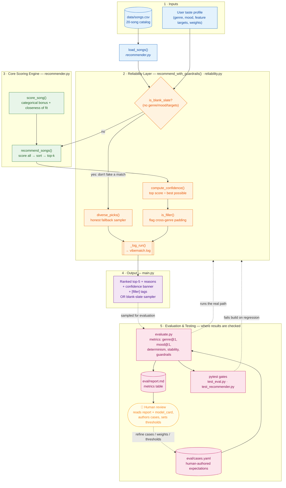

# VibeMatch — System Architecture

This diagram shows how VibeMatch is organized: the components, how data flows
from input to output, and where **testing and human review** check the AI's
results. The advanced feature is a **Reliability / Testing system**, so the
diagram highlights both the guardrails that run inline (changing what the app
returns) and the offline evaluation harness that measures and gates that
behavior.

## How to read it

1. **Inputs** — a hand-labeled song catalog (`songs.csv`) and a user taste
   profile flow in.
2. **Reliability layer** (`recommend_with_guardrails`) is the entry point. It
   first asks *"do we know this user?"* An empty profile is routed to an honest
   diverse sampler instead of a fake ranking; a real profile is scored.
3. **Core scoring engine** ranks songs by categorical match + closeness of fit.
4. Back in the reliability layer, the result gets a **confidence** score,
   **filler** flags, and a **log line** — then the **output** shows the ranked
   list with its reliability banner.
5. **Evaluation & testing** is where results are checked. `evaluate.py` runs the
   *same guarded path* over human-authored expectations in `cases.yaml`,
   produces `report.md`, and feeds `pytest` gates that fail the build on
   regression. A **human** reads the report and model card, authors the cases,
   and sets the thresholds — closing the loop back onto the inputs and weights.

**Human / testing checkpoints** are the pink and yellow nodes in section 5:
humans author the expected outcomes and thresholds, and the automated harness +
pytest gates verify the AI's output against them on every run.